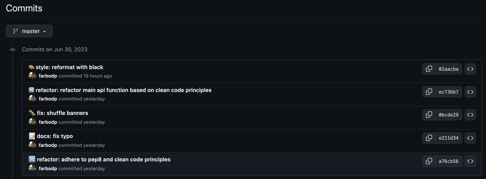

# Top Banner Ads :chart_with_upwards_trend:

This is a single web page application that serves banner ads on a website. Banners are selected based on their revenue performance. While the web app itself is relatively straightforward (picture shown in below), its purpose is to showcase the banners selection logic of the backend.


Dataset consists of 3 csv files:

1. impressions.csv
    - columns: `banner_id`, `campaign_id`
2. clicks.csv
    - columns: `click_id`, `banner_id`, `campaign_id`
3. conversions.csv
    - columns: `conversion_id`, `click_id`, `revenue`

By querying the above data sets, performance of the banners based on their revenue can be found (available in the conversions.csv).

##  Business Rules :briefcase:

If you assume `X is the number of banners with conversions within a campaign`, then there are a few possible scenarios:

| Scenario      | Requirement |
| ------------- |-------------|
| X>=10         | Show the Top 10 banners based on revenue within that campaign |
| X in range(5, 10)      | Show the Top X banners based on revenue within that campaign      |
| X in range(1,5) | Collection of banners should consist of 5 banners, containing: The top X banners based on revenue within that campaign and Banners with the most clicks within that campaign to make up a collection of 5 unique banners.      |
| X == 0 | Show the top ­5 banners based on clicks. If the number of banners with clicks is less than 5 within that campaign, then you should add random banners to make up a collection of 5 unique banners. |

## Technical Requirements :computer:

1. To avoid saturation for visitors, we believe that the top banners being served should not follow a fixed order based on their performance; but they should appear in a random sequence.

2. You should also avoid having a banner served twice in a row for a unique visitor.

3. The 4 sets of CSV's represent the 4 quarters of an hour. So when I visit the website during 00m­-15m (excluding 15), I want to see banners being served based on the statistics of the first dataset, and if I visit your site during 15m-­30m, I want to see the banners being served based on the second dataset, so on so forth.

4. The application should serve at least 5000 requests per minute ­ The script and results of the stress­ test should be provided.

## Logic of Banner Selection

The second technical requirement is to never show one banner twice in a row for a unique visitor. This requirement and the business rules are somehow contradictory, but I tried to solve it this way:
First when a visitor visits the url, I go by the business rules (`top_banners_by_campaign_id` function). The second time, I pick the top 10 banners sort by the revenue and the clicks count, but excluding the previously shown banners (`top_banners_by_campaign_id_second_visit` function). I cache the visitors' IPs in `seen_banners_cache` variable, which is a TTL cached dictionary.


## Implementation Details

### Code Simplicity

The main banner serving API is shown in below. Despite the complexity of the business rules, the function is easy to follow. The function clearly shows the logic flow. This is because the [Clean Code Principles](https://thixalongmy.haugiang.gov.vn/media/1175/clean_code.pdf) are complied here. The code is modular, the functions are divided into smaller, focused functions to improve readability and maintainability. Each function has a single responsibility. 

```python
@app.get("/campaigns/{campaign_id}", response_class=HTMLResponse)
def get_images(campaign_id: int, request: Request):
    hour_quarter = get_hour_quarter()

    # Determine visitor IP
    visitor_ip = request.client.host

    # Check cache for seen banners
    if (
        visitor_ip in seen_banners_cache
        and seen_banners_cache[visitor_ip] is not None
    ):
        top_banner_ids = top_banners_by_campaign_id_second_visit(
            campaign_id, hour_quarter, visitor_ip
        )
        seen_banners_cache[visitor_ip] = None
    else:
        top_banner_ids = top_banners_by_campaign_id(
            campaign_id=campaign_id, hour_quarter=hour_quarter
        )
        seen_banners_cache[visitor_ip] = top_banner_ids

    shuffle(top_banner_ids)

    # Generate HTML content
    html_content = generate_html_content(top_banner_ids, STATIC_DIR_NAME)

    return html_content
```

The `top_banners_by_campaign_id` function has a large number of pandas queries to meet the business requirements. Some of these queries may appear counterintuitive, so helper functions are developed to make the code more readable and maintainable.

```python
@lru_cache(maxsize=128)
def top_banners_by_campaign_id(campaign_id, hour_quarter):
    impressions = csv_sets[f"impressions_{hour_quarter}"]
    clicks = csv_sets[f"clicks_{hour_quarter}"]
    conversions = csv_sets[f"conversions_{hour_quarter}"]

    validate_campaign_id(impressions, campaign_id)

    joined_data = join_dataframes(impressions, clicks, conversions)
    campaign_data = filter_campaign_data(joined_data, campaign_id)
    banner_revenue_clicks = calculate_banner_revenue_clicks(campaign_data)

    banners_with_conversions_count = count_banners_with_conversions(
        banner_revenue_clicks
    )

    top_banners = None

    if banners_with_conversions_count >= 10:
        top_banners = select_top_revenue_banners(banner_revenue_clicks, 10)
    elif 5 <= banners_with_conversions_count < 10:
        top_banners = select_top_revenue_banners(
            banner_revenue_clicks, banners_with_conversions_count
        )
    elif 1 <= banners_with_conversions_count < 5:
        most_conversion_banners = select_top_revenue_banners(
            banner_revenue_clicks, banners_with_conversions_count
        )
        most_clicked_banners = select_most_clicked_banners(
            banner_revenue_clicks
        )
        top_banners = combine_top_banners(
            most_conversion_banners, most_clicked_banners
        )
    else:
        most_clicked_banners = select_most_clicked_banners(
            banner_revenue_clicks
        )
        clicked_banners_count = most_clicked_banners.shape[0]

        if clicked_banners_count < 5:
            random_rows_count = 5 - clicked_banners_count
            random_banners = select_random_banners(
                banner_revenue_clicks, random_rows_count
            )
            top_banners = combine_top_banners(
                most_clicked_banners, random_banners
            )
        else:
            top_banners = most_clicked_banners

    return list(top_banners.index)
```

### De-duplication Logic

There is a `log_duplicates` function in utils.py that logs the duplicate rows of datasets in a very elegant manner.

```python
def log_duplicates(file_path, df, log_file_path):
    duplicates = df[df.duplicated()]
    if duplicates.empty:
        return

    logger = logging.getLogger(__name__)
    logger.setLevel(logging.DEBUG)

    file_handler = logging.FileHandler(log_file_path)
    file_handler.setLevel(logging.DEBUG)

    formatter = logging.Formatter('%(asctime)s - %(levelname)s - %(message)s')
    file_handler.setFormatter(formatter)

    logger.addHandler(file_handler)
    logger.debug(
        f"Found {len(duplicates)} duplicate rows in {file_path}:\n{duplicates.to_string()}"
    )
```

### Stress test

Stress test script is written using the [Locust](https://locust.io/) package and can be found in the locustfile.py file.

To run the web UI, enter the following command:

```sh
locust --users 50 --spawn-rate 5 --host=http://localhost:8000
```

The stress test result (running locally) is shown in below:


Since I used caching, the response time gradually decreases as the results are being cached. Eventually, the app handles 160 rps, which is 9600 requests per minute. It should be mentioned that we have 50 concurrent users in this stress test, as stated in the command above.

### In-memory Database

Since the size of the CSV files are too small (1MB), they are loaded in memory before the server starts. Obviously if the data files were bigger, a proper SQL database was needed.

```python
csv_sets = {}

@app.on_event("startup")
def startup_event():
    csv_files = {
        'impressions': ['1', '2', '3', '4'],
        'clicks': ['1', '2', '3', '4'],
        'conversions': ['1', '2', '3', '4'],
    }

    for file_type, file_nums in csv_files.items():
        for num in file_nums:
            file_path = f"csv/{num}/{file_type}_{num}.csv"
            log_file_path = f"logs/{file_type}_{num}_duplicates.log"

            csv_sets[f"{file_type}_{num}"] = read_csv_remove_duplicates(
                file_path, log_file_path
            )

```

### Descriptive Commit Messages

Commit messages follow the [Conventional Commits specification](https://www.conventionalcommits.org/en/v1.0.0/) and have emojis to make them more descriptive and easy for collaboration.



## Installation

1. Clone the repository.
2. Install the dependencies
```sh
pip install -r requirements.txt
```

### Running the App

You can run the app using either uvicorn or gunicorn.

### Using uvicorn

Open a terminal and navigate to the root directory of the app. Run the following command: 

```sh
uvicorn main:app --reload
```

### Using gunicorn (for production)

Open a terminal and navigate to the root directory of the app.

Run the following command:
```sh
gunicorn -w 4 -k uvicorn.workers.UvicornWorker main:app
```
